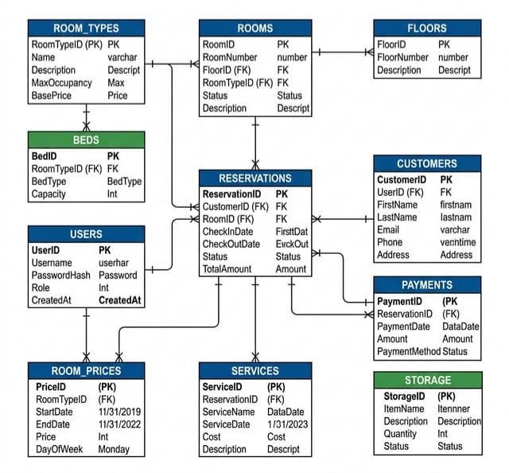
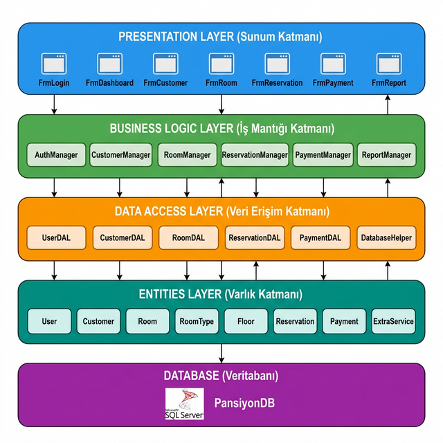
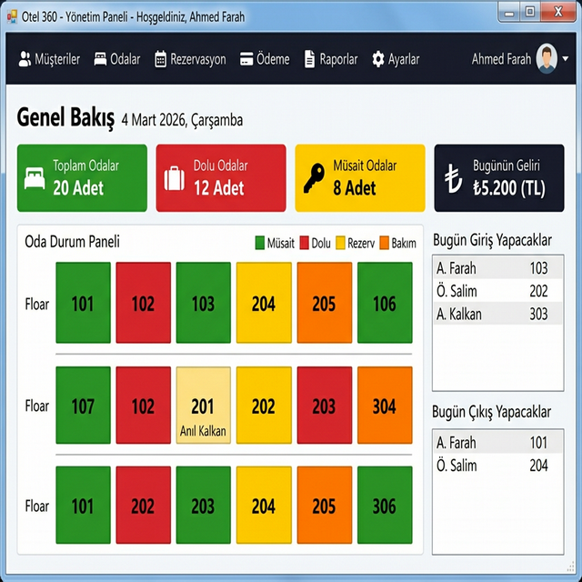
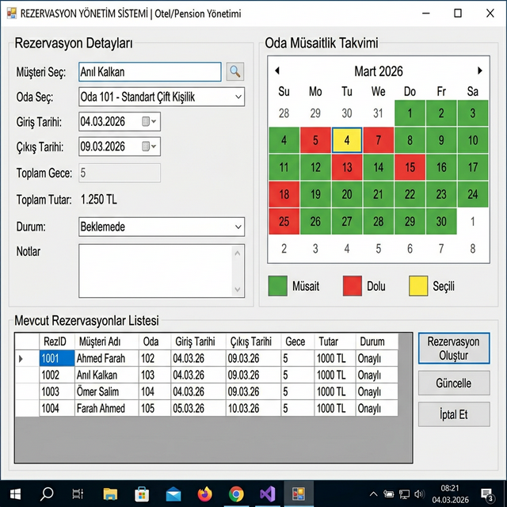

# PMS-Y-NETIM- (Property Management System)

Bu proje, kapsamlı bir pansiy/Mülk Yönetim Sistemi (Property Management System) olarak tasarlanmıştır. Modern .NET teknolojileri kullanılarak geliştirilmiş, kullanıcı dostu ve işlevsel bir masaüstü uygulamasıdır.

## 🚀 Proje Hakkında (Açıklama)

PMS-Y-NETIM, otel sahiplerinin veya mülk yöneticilerinin operasyonlarını tek bir merkezden yönetmelerini sağlar. Müşteri kayıtlarından oda rezervasyonlarına, depo takibinden ödeme işlemlerine kadar geniş bir yelpazede hizmet sunar.

### 🛠️ Ne Amaçla Kullanılır?
- **Müşteri Yönetimi:** Müşterilerin bilgilerini kaydetmek, güncellemek ve geçmiş işlemlerini takip etmek için.
- **Oda & Rezervasyon:** Odaların durumunu (dolu/boş) izlemek, yeni rezervasyonlar oluşturmak ve oda tiplerini yönetmek için.
- **Depo (Storage) Takibi:** Otel envanterindeki ürünlerin miktarını ve stok durumunu kontrol etmek için.
- **Kat & Yatak Planlaması:** Kat düzenleri ve oda içi yatak kapasitelerini özelleştirmek için.
- **Güvenlik:** Yetkilendirilmiş giriş ve kayıt sistemleri (AuthHelper) ile verilerin güvenliğini sağlamak için.

## 💻 Kullanılan Teknolojiler

- **Dil:** C#
- **Framework:** .NET 8.0-Windows (WinForms)
- **Veritabanı:** MySQL (`MySql.Data` kütüphanesi ile)
- **Mimari:** Katmanlı Mimari (Models, Forms, Database, Helpers)
- **IDE:** Visual Studio 2022

## 📦 Proje Yapısı

- **Models:** Veri modelleri (Customer, Room, Reservation, User, vb.)
- **Forms:** Kullanıcı arayüz ekranları (Dashboard, Login, Register)
- **Database:** Veritabanı bağlantı ve veri erişim sınıfları (DataAccess)
- **Helpers:** Yardımcı araçlar ve yetkilendirme mantığı (AuthHelper)
- **images:** Mimari şemalar ve ekran görüntüleri

## 🖼️ Ekran Görüntüleri ve Şemalar

Projeye ait bazı görseller şu şekildedir:

### Veritabanı Şeması


### Mimari Yapı


### Dashboard (Panel)


### Rezervasyon Ekranı


## 🔧 Kurulum ve Çalıştırma

1. Projeyi bilgisayarınıza klonlayın:
   ```bash
   git clone https://github.com/AHMETfarah22/PMS-Y-NETIM-.git
   ```
2. **Visual Studio** ile `.sln` dosyasını açın.
3. Bağımlılıkları geri yükleyin (NuGet paketleri otomatik yüklenecektir).
4. `DataAccess.cs` veya yapılandırma dosyasındaki MySQL bağlantı dizesini (Connection String) kendi veritabanı ayarlarınıza göre güncelleyin.
5. Projeyi **Derleyin (Build)** ve **Çalıştırın (Run)**.

## 👥 Yazar
Bu proje **AHMETfarah22** tarafından geliştirilmektedir.
